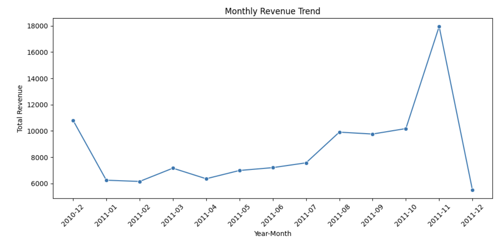

# Retail Sales Exploratory Data Analysis

An exploratory data analysis project using **Python and Pandas** to examine retail transaction data, identify sales patterns, explore customer and product performance, and generate business insights.



## 📌 Project Overview

This project explores retail transaction data to better understand sales performance across products, customers, countries, time periods, and transaction patterns.

The analysis covers the complete exploratory workflow, including data understanding, data preparation, feature engineering, data manipulation, visualization, and multivariate analysis.

The goal is to transform raw transactional data into meaningful insights that can support business decision-making.

---

## 🎯 Analytical Questions

The analysis focuses on five main questions:

1. Which country generates the highest revenue?
2. Which products have the highest sales quantity?
3. How does revenue change over time?
4. Which countries have the largest number of customers?
5. Which days of the week have the highest number of transactions?

An additional multivariate analysis was also conducted to understand relationships between numerical variables.

---

## 📊 Dataset

The dataset contains retail transaction information, including:

- Invoice information
- Product descriptions
- Quantity purchased
- Transaction date
- Unit price
- Customer information
- Customer country

These variables were used to analyze sales performance from several perspectives, including revenue, products, customers, geography, and time.

---

## 🧹 Data Preparation

Before conducting the analysis, the dataset was explored and prepared to ensure that the variables could be used appropriately.

The preparation process included:

- Inspecting the dataset structure and data types
- Checking missing values
- Checking duplicate records
- Converting `InvoiceDate` into datetime format
- Exploring the distribution of `Quantity` and `UnitPrice`
- Creating a new `Revenue` feature using:

  `Revenue = Quantity × UnitPrice`

- Creating time-related variables to support monthly and day-of-week analysis

---

## 🔎 Analysis Approach

The project uses several Python and Pandas techniques to explore the dataset and answer the analytical questions.

Techniques applied include:

- Filtering
- Sorting
- Grouping and aggregation
- Pivot tables
- Datetime manipulation
- Feature engineering
- Data visualization
- Correlation analysis

These techniques were used to examine the data from different business perspectives rather than analyzing individual variables in isolation.

---

## 💡 Key Findings

### 1. Revenue by Country

The analysis compares revenue contribution across countries to identify the strongest geographic markets.

The **United Kingdom** emerged as the primary market based on revenue, showing that a significant part of the business activity is concentrated in this market.

### 2. Product Performance

Product-level analysis was conducted using total quantity sold.

**White Hanging Heart T-Light Holder** recorded the highest sales quantity, making it one of the most prominent products in the dataset based on units sold.

### 3. Monthly Revenue Trend

Revenue was aggregated by month to understand how sales performance changed over time.

The analysis shows that revenue fluctuated across the observed period, with **November 2011** recording the highest monthly revenue.

This suggests that sales performance may be influenced by seasonal or period-specific factors that could be investigated further.

### 4. Customer Distribution

Customer distribution was analyzed by country to understand where the customer base is concentrated.

The **United Kingdom** had the largest customer presence, consistent with its strong contribution to overall revenue.

### 5. Transactions by Day

Transaction activity was compared across days of the week.

**Thursday recorded the highest number of transactions**, indicating that transaction activity was not evenly distributed throughout the week.

---

## 🔗 Correlation Analysis

A correlation heatmap was used to examine relationships between numerical variables.

One of the strongest relationships identified was between **Quantity and Revenue**, with a correlation of approximately **0.79**.

This indicates that higher quantities sold are strongly associated with higher transaction revenue in the analyzed dataset.

However, correlation does not necessarily imply causation, and other factors such as unit price may also influence revenue.

---

## 📈 Key Takeaways

Overall, the exploratory analysis highlights several patterns:

- The United Kingdom dominates both revenue contribution and customer concentration.
- Product demand varies considerably, with several products contributing much higher quantities than others.
- Revenue changes over time and reaches its highest level in November 2011.
- Transaction activity varies across the week, with Thursday showing the highest activity.
- Quantity has a strong positive relationship with revenue.

These findings provide an initial understanding of the business and can serve as a foundation for deeper analysis of customer behavior, product performance, seasonality, and market opportunities.

---

## 🛠️ Tools & Libraries

- **Python**
- **Pandas**
- **NumPy**
- **Matplotlib**
- **Seaborn**
- **Jupyter Notebook**

---

## 🧠 Skills Demonstrated

- Exploratory Data Analysis (EDA)
- Data Understanding
- Data Cleaning
- Data Manipulation
- Feature Engineering
- Grouping & Aggregation
- Pivot Tables
- Datetime Analysis
- Data Visualization
- Correlation Analysis
- Business Insight Generation

---

## 📂 Repository Structure

```text
retail-sales-eda-python/
│
├── README.md
├── retail-sales-eda.ipynb
└── eda-preview.png
```

---

## 📓 Full Analysis

The complete analysis, including Python code, data exploration, visualizations, and detailed observations, is available in the Jupyter Notebook:

➡️ **[View the Full Analysis](retail-sales-eda.ipynb)**

---

## 👤 Author

**Sabila Rahma Utomo**

Product Manager developing hands-on capabilities in Data Analytics to support more data-informed product and business decision-making.
